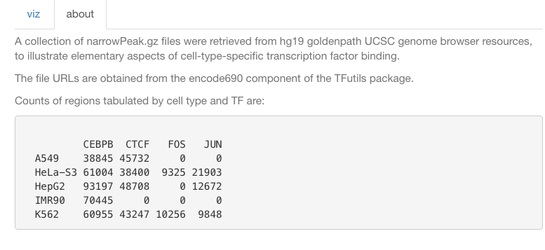
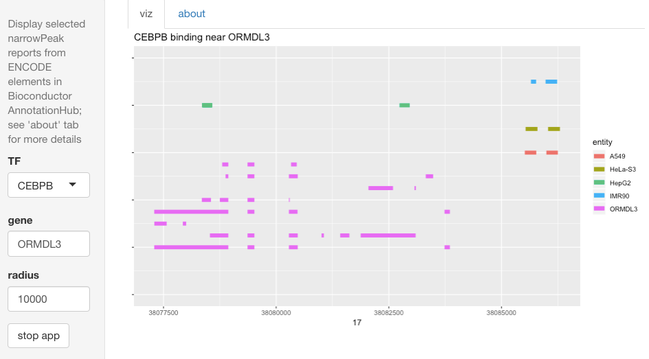

# encdemo

This repository houses a simple shiny app that illustrates the resources
in Bioconductor for depicting cell-type-specific transcription factor binding
as reported in ENCODE.

The visualization is primitive, and is provided only to indicate some of the
issues at stake in creating genome-scale analyses of genomic events.

To permit illustration on very-low-cost server infrastructure, we focus attention
to a small number of TFs and a small number of cell types:

The user can select any gene in Ensembl V75 for a transcript layout, and can
select a radius around the gene to display binding events for the TFs
noted above.  The intervals reported in ENCODE narrowPeak files are plotted.

